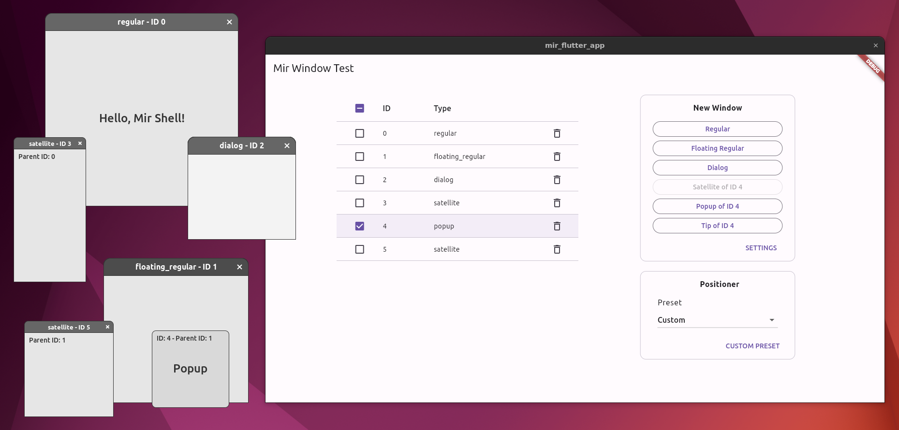
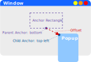

# mir_flutter_app

Reference application demonstrating multi-window support for Flutter on Linux using the Mir windowing language.



Supported window types:

* **Regular**: Regular "top level" window.
* **Floating regular**: Always-on-top regular window.
* **Dialog**: Temporary window that prompts the user for a response. If a dialog has a parent, it is modal to the parent and any satellites the parent has.
* **Satellite**: Accessory window to a regular, floating regular, or dialog window.
* **Popup**: Temporary, interactive window.
* **Tip**: Temporary, non-interactive window.

## How To Build

1. Get the source:
    ```sh
    git clone https://github.com/hbatagelo/mir_flutter_app.git
    cd mir_flutter_app
    ```
2. Install the Flutter SDK following the [guide for building Flutter native desktop apps on Linux](https://docs.flutter.dev/get-started/install/linux/desktop).
3. Build with:

    ```sh
    flutter build linux
    ```

## How To Run

The application requires a Wayland compositor with support for the [Mir shell](https://github.com/canonical/mir/blob/main/wayland-protocols/mir-shell-unstable-v1.xml) protocol extension (`mir_shell_unstable_v1`).

In the following, we'll use [Miriway](https://snapcraft.io/miriway), a customizable Wayland compositor that supports Mir shell and provides a default "floating" window manager suitable for demonstrating the different types of desktop windows.

To make sure that Mir shell is supported, install the miriway snap package from the "latest/edge" channel:

```sh
sudo snap install miriway --edge --classic
```

After the installation, open a Virtual Terminal and launch Miriway:

```sh
miriway
```

In the new graphical shell, press <kbd>Ctrl-Alt-T</kbd> to launch a terminal.

Navigate to the directory containing the source and start the application:

```sh
cd mir_flutter_app
flutter run
```

You'll see the main "mir_flutter_app" window as shown in the screenshot above.

Use the buttons in the "New Window" group to create desktop windows of different types.

Select a window list entry to designate the parent window for the next **dialog**, **satellite**, **popup**, or **tip** window. If no entry is selected, dialogs will be created without a parent, and the creation of **satellite**, **popup**, and **tip** windows will be disabled. When a new **regular** or **floating regular** window is created, its entry in the window list is automatically selected.

The placement of **satellite**, **popup**, and **tip** windows depends on the "Anchor Rectangle" settings (defined in the "Settings" option) and the selected positioner preset. Refer to [Defining a Positioner](#defining-a-positioner) for details about anchor rectangles and positioners. When these windows are created, the application automatically cycles through the presets. A fixed custom preset can be used by selecting "Custom" in the "Preset" dropdown button. The settings of the custom preset can be adjusted via the "Custom Preset" option.

### Window Interaction

The following input actions are available for **regular**, **floating regular**, and **satellite** windows:

- **Move window**: Left Mouse Button + Drag.
- **Resize window**: Right Mouse Button + Drag.
- **Close window**: Press <kbd>Escape</kbd> or click the "close button" in the title bar.

**Popup** windows cannot be moved or resized but can be closed by clicking on them.

**Tip** windows are not interactive and can only be closed by closing the parent or by clicking on the trashcan icon in the window list.

## Dart API

The native platform code provides an API that enables the Flutter app to create, close, and inquire about the current state of windows. Refer to [main.dart](/lib/main.dart) for an example of usage.

### Creating and Destroying Windows

*   #### Creates a regular window:
    ```dart
    Future<int> createRegularWindow(Size size) async
    ```
    Parameters:
    * `size`: Requested window size.

    The return value is a future that returns the ID of the newly created window.

*   #### Creates a floating regular window:
    ```dart
    Future<int> createFloatingRegularWindow(Size size) async
    ```
    Parameters:
    * `size`: Requested window size.

    The return value is a future that returns the ID of the newly created window.

*   #### Creates a dialog window:
    ```dart
    Future<int> createDialogWindow(Size size, int? parent) async
    ```
    Parameters:
    * `size`: Requested window size.
    * `parent`: Optional ID of the parent window. If `null`, a parentless dialog is created.

    The return value is a future that returns the ID of the newly created window.

*   #### Creates a satellite window:
    ```dart
    Future<int> createSatelliteWindow(
        int parent,
        Size size,
        Rect anchorRect,
        FlutterViewPositioner positioner) async
    ```
    Parameters:
    * `parent`: ID of the parent window.
    * `size`: Requested window size.
    * `anchorRect`: Anchor rectangle within the parent surface that the child surface will be placed relative to. The rectangle is relative to the window geometry of the parent surface and may not extend outside the window geometry of the parent surface.
    * `positioner`: Positioning preferences. See [Defining a Positioner](#defining-a-positioner).

    The return value is a future that returns the ID of the newly created window.

*   #### Creates a popup window:
    ```dart
    Future<int> createPopupWindow(
        int parent,
        Size size,
        Rect anchorRect,
        FlutterViewPositioner positioner) async
    ```
    Parameters:
    * `parent`: ID of the parent window.
    * `size`: Requested window size.
    * `anchorRect`: Anchor rectangle within the parent surface that the child surface will be placed relative to. The rectangle is relative to the window geometry of the parent surface and may not extend outside the window geometry of the parent surface.
    * `positioner`: Positioning preferences. See [Defining a Positioner](#defining-a-positioner).

    The return value is a future that returns the ID of the newly created window.

*   #### Creates a tip window:
    ```dart
    Future<int> createTipWindow(
        int parent,
        Size size,
        Rect anchorRect,
        FlutterViewPositioner positioner) async
    ```
    Parameters:
    * `parent`: ID of the parent window.
    * `size`: Requested window size.
    * `anchorRect`: Anchor rectangle within the parent surface that the child surface will be placed relative to. The rectangle is relative to the window geometry of the parent surface and may not extend outside the window geometry of the parent surface.
    * `positioner`: Positioning preferences. See [Defining a Positioner](#defining-a-positioner).

    The return value is a future that returns the ID of the newly created window.

* #### Closes a window:
    ```dart
    void closeWindow(int windowId)
    ```
    Parameters:
    * `windowId`: ID of the window.

    When the window closes, its ID is invalidated and may be reused by other `create*` functions.

### Querying Window State

The following state querying functions are used by the prototype Flutter app to display the type of each window in the window list and to ensure that a user-defined anchor rectangle stays within the size of the parent surface.

* #### Queries the window type:
    ```dart
    Future<String> getWindowType(int windowId) async
    ```
    Parameters:
    * `windowId`: ID of the window.

    The return value is a future that returns a string describing the window type: "regular", "floating_regular", "dialog", "satellite".

* #### Queries the window size:
    ```dart
    Future<Size> getWindowSize(int windowId) async;
    ```
    Parameters:
    * `windowId`: ID of the window.

    The return value is a future that returns the current window size.

### Callbacks

When a window is closed, the native platform code calls `onWindowClosed(int windowId)`, where `windowId` is the ID of the window that has been closed. The Flutter app listens for this method call by registering a method call handler using `setMethodCallHandler` on the `io.mir-server/window` channel.

### Defining a Positioner

Positioning preferences are created using the[`FlutterViewPositioner`](/lib/flutter_view_positioner.dart) class. Its attributes specify the rules for the placement of **satellites**, **popups**, and **tips** relative to the anchor rectangle of the parent window, as illustrated below:



The placement shown in this illustration can be achieved using the following positioner's definition:

```dart
var positioner = FlutterViewPositioner(
    parentAnchor: FlutterViewPositionerAnchor.bottom,
    childAnchor: FlutterViewPositionerAnchor.topLeft,
    offset: Offset(70, 36),
    constraintAdjustment: <FlutterViewPositionerConstraintAdjustment>{
    FlutterViewPositionerConstraintAdjustment.slideX,
    FlutterViewPositionerConstraintAdjustment.slideY,
    });
```
> Notice that the anchor rectangle is not defined in `FlutterViewPositioner`. The anchor rectangle is passed as a separate argument to `createSatelliteWindow`, `createPopupWindow`, and `createTipWindow`.

The attributes of `FlutterViewPositioner` are as follows:

* `parentAnchor`: A [`FlutterViewPositionerAnchor`](/lib/flutter_view_positioner.dart) enumeration value specifying the anchor point for the anchor rectangle:
    * `center`: Centered.
    * `top`: Centered at the top edge.
    * `bottom`:  Centered at the bottom edge.
    * `left`: Centered at the left edge.
    * `right`: Centered at the right edge.
    * `topLeft`: Top-left corner.
    * `bottomLeft`: Bottom-left corner.
    * `topRight`: Top-Right corner.
    * `bottomRight`: Bottom-Right corner.

* `childAnchor`: A [`FlutterViewPositionerAnchor`](/lib/flutter_view_positioner.dart) enumeration value specifying the anchor point for the child window.
* `offset`: The [`Offset`](https://api.flutter.dev/flutter/dart-ui/Offset-class.html) from the parent anchor to the child anchor.
* `constraintAdjustment`: A set of [`FlutterViewPositionerConstraintAdjustment`](/lib/flutter_view_positioner.dart) enumeration values defining how the compositor will adjust the position of the window, if the unadjusted position would result in the surface being partly constrained.

    `FlutterViewPositionerConstraintAdjustment` defines the following values:

    * `slideX`: Adjust the offset along the X axis.
    * `slideY`: Adjust the offset along the Y axis.
    * `flipX`: Reverse the anchor points and offset along the X axis.
    * `flipY`: Reverse the anchor points and offset along the Y axis.
    * `resizeX`: Adjust the size of the child window along the X axis.
    * `resizeY`: Adjust the size of the child window along the Y axis.

    When combined, the adjustments follow a defined precedence:
    1. Flip
    2. Slide
    3. Resize

    Whether the window is considered "constrained" depends on the compositor. For example, the surface may be partly outside the outputs's "work area", thus necessitating the child window's position be adjusted until it is entirely inside the work area.

## How It Works

When a method call is received from the Flutter app to create a window, the native platform code creates a GTK window and marks it as a custom Wayland surface. The application manually registers an `xdg_surface` for the Wayland surface and allocates shared memory buffers to be used for rendering the surface contents using Cairo. Input is handled through `wl_seat`.

When a **popup** or **tip** window is created, an `xdg_popup` role is assigned to the `xdg_surface`, and an `xdg_positioner` object is used for placement.

If the window type is **regular**, **floating regular**, **dialog**, or **satellite**, an `xdg_toplevel` role is assigned to the `xdg_surface`, and the Mir shell protocol extension is used to augment the state of the toplevel surface according to the corresponding Mir shell "archetype": `mir_regular_surface`, `mir_floating_regular_surface`, `mir_dialog_surface`, `mir_satellite_surface`. For these windows, the positioner is defined using a `mir_positioner` object.

## Acknowledgments

Special thanks to [Robert Ancell](https://github.com/robert-ancell) for providing the code which served as the starting point for this application.